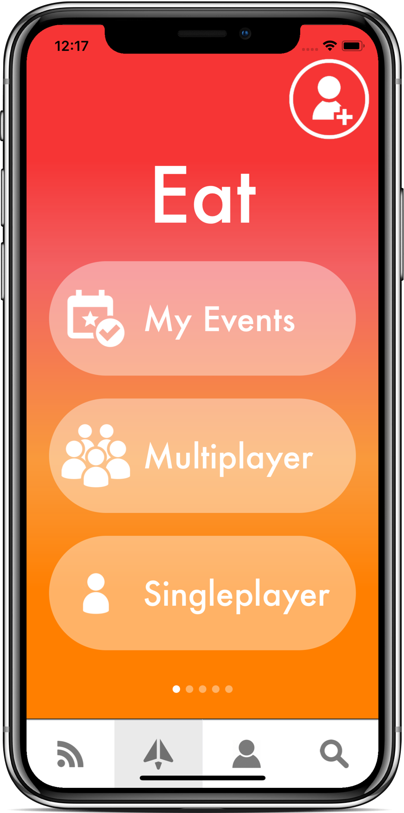

# Fork It

Fork It is a mobile app designed to "gamify" the planning process for fun activities, such as going out to eat, see a concert, etc. The app was first conceptualized at a hackathon as a simple decision maker where users entered certain parameters (type of cuisine, priciness, etc.) to find restaurants nearby (think of this as "singleplayer"). After the hackathon, my team was excited about the idea, so we continued to work on the app for a few months and added a "multiplayer" mode, which was designed to streamline the entire planning process for various activities with friends. We first focused on creating the "Eats" feature for going out to eat with friends and presented this prototype at a Demo Day for the SF community.

# How It Works

The user experience asks 5 simple question and intelligently narrows the user's final decision to three choices. Each of the options has details on the restaurant as well the option to map, Uber, or Lyft to the destination immediately. Future features of the project will include discovery tools for nightlife, arts/culture, and live events.

# Sign Up & Login

Users are able to easily register via facebook or email. Their data is stored as future plans exist to retain user preferences, favorite locations/events, as well as friends.

# 
